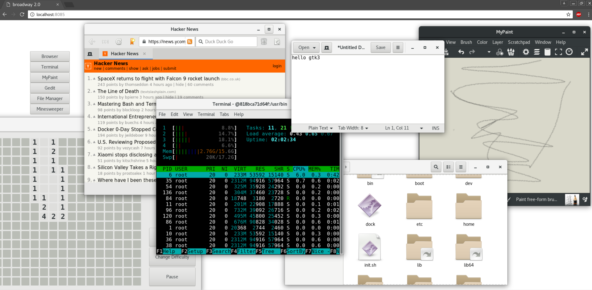

# gtk3-docker

Run native gtk3+ applications inside a container via the browser

## Instructions

`docker run --rm -p 8085:8085 chadmoon/gtk3-docker`

Open `http://localhost:8085`

or build image locally

`docker build -t gtk3-docker .`
`docker run --rm -p 8085:8085 gtk3-docker`

## Description

This container is based on arch linux. It sets up the environment to use the BROADWAY html5 display for rendering applications. A small gtk3+ "launcher" application is used as the entrypoint. 